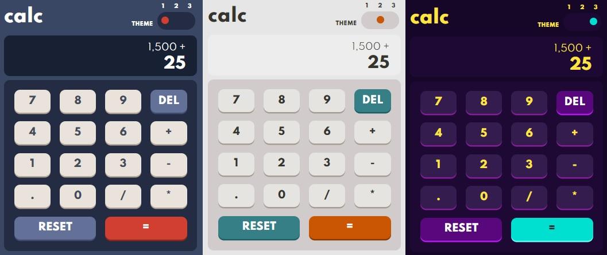

# Javascript calculator

The calculator is avaiable [in this link](https://mauricio-tejada.github.io/Calculator/)



<br>

## Summary

- [Overview](#overview)
  - [Links](#links)
- [Features](#features)
  - [Theme selector toggle](#theme-selector-toggle)
  - [Click effect](#click-button-effect)
  - [Two lines display](#two-lines-display)
- [My process](#my-process)
  - [Built with](#built-with)
  - [What I learned](#what-i-learned)
- [Author](#author)
## Overview

Users should be able to:

- See the size of the elements adjust based on their device's screen size
- Perform mathmatical operations like addition, subtraction, multiplication, and division
- Adjust the color theme based on their preference

### Links

- [Github repository](https://github.com/mauricio-tejada/Calculator)
- [Live Site URL](https://mauricio-tejada.github.io/Calculator/)

## Features

### Theme selector toggle

You can change the colors of the calculator using the toggle button.


### Click button effect

The buttons have a click effect that gives the impression that the button is realy being pressed.


### Two lines display

The display is divided in two lines for a better experience.


## My process
### Built with

- Javascript
- HTML5
- CSS 3 (SASS preprocessor)
- Git

For the theme changer i made some functions, dividing each one with a functionality

```js
//function that return the radio input that is checked
function verifyChecked() {
}

//funcion that add class to their respective elements
function addClass(theme) {
}

//function that remove all the others theme class of the elements that will receive a new theme class
function removeClass(theme) {  
}

//function that change the theme, removing the previous theme and applying the new
function changeTheme() {
}
```

For calculator i made a class Calculator with all methods necessary for calculate and manipulate the display.

```js
class Calculator {
    constructor(previousOperandTextElement, currentOperandTextElement) {
    }

    formatDisplayNumber(number) {
    }

    delete() {
    }

    calculate() {
    }

    chooseOperation(operation) {
    }

    appendNumber(number) {
    }

    clear() {
    }

    updateDisplay() {
    }
}

const calculator = new Calculator(previousOperandTextElement, currentOperandTextElement)
```
### What I learned

In additional to improve my HTML and CSS skills, i was very challenged mainly in Javascript skills. In fact, this is my first Javascript project made just by me, and i could put into practice a lot knowledge as DOM manipulation, classes and object orientation.


## Author

- Github profile - [Mauricio Tejada](https://github.com/mauricio-tejada)
- Frontend Mentor profile - [Mauricio Fernandes](https://www.frontendmentor.io/profile/mauricio-tejada)
- Linkedin - [Mauricio Fernandes Tejada](https://www.linkedin.com/in/mauricio-tfernandes/)

